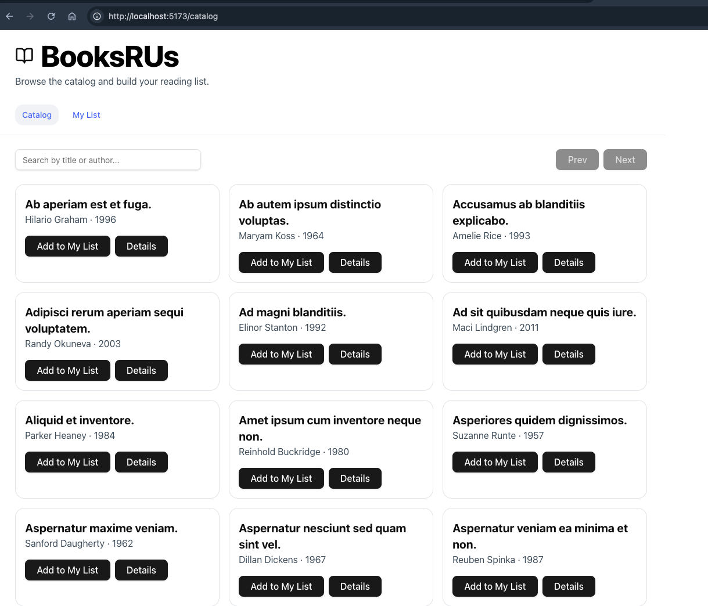

# ReadMe - Setup Instructions

## Run Locally with Docker Compose



## Architecture

```bash
   ┌─────────────┐       ┌───────────────┐       ┌───────────────┐
   │   Frontend  │──────▶│    Backend    │──────▶│   PostgreSQL  │
   │ (Vite/React)│       │  (.NET 8 API) │       │   (booksrus)  │
   │ Port 5173   │       │   Port 5050   │       │   Port 5432   │
   └─────────────┘       └───────────────┘       └───────────────┘
```

---

## Prerequisites

- **Docker Desktop** (or Docker Engine + docker-compose plugin)  
- Ports free on your host:
  - `5173` (frontend)
  - `5050` (backend)
  - `5432` (PostgreSQL)
- Clone the Repository locally

---

## 1. Build & Start All Services

```bash
docker compose build --no-cache
docker compose up
```

## 2. Verify

- Backend is working : Open http://localhost:5050/swagger/index.html
- Database is working : Open http://localhost:5050/swagger/index.html , and make a GET call
- FrontEnd WebApp is working: Open http://localhost:5173
- Confirm that the Catalog & My List pages load

## 3. Stop Containers

```bash
docker compose down
```

## 4. Tips
- Always run docker compose down -v if you want a clean reset (removes volumes and data).
- To run Postgres docker image as standalone:

```bash
docker run --name pg-booksrus \                      
  -e POSTGRES_PASSWORD=app -e POSTGRES_USER=app -e POSTGRES_DB=booksrus \
  -p 5432:5432 -d postgres:16
```